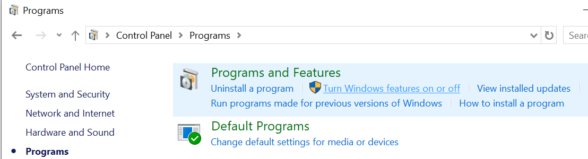
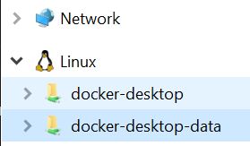

# laptop-setup
Set up a new machine how I like for python development.

Scripts for macOSX and Windows.

<!-- START doctoc generated TOC please keep comment here to allow auto update -->
<!-- DON'T EDIT THIS SECTION, INSTEAD RE-RUN doctoc TO UPDATE -->
**Contents**

- [What is Installed?](#what-is-installed)
- [Download Separately](#download-separately)

<!-- END doctoc generated TOC please keep comment here to allow auto update -->

## What is Installed?

Platform install tools:
- [macOS] Homebrew
- [windows] Scoop

General Tools:
- Git
- pre-commit

Python management tools:
- Miniconda
- pipx
- poetry
- ruff

## Download Separately

[**VSCode**](https://code.visualstudio.com/download) - prefered editor

### [Docker](https://www.docker.com/products/docker-desktop/)

**Windows Specific Instructions:**

Installing Docker on Windows was a little tricky because there are extra configurations you need to do to enable Linux virtualization.

Before installing Docker Desktop, follow instructions for setting up your [system requirements](https://docs.docker.com/desktop/install/windows-install/). Full instructions for enabling and troubleshooting virtualization features can be found [here](https://docs.docker.com/desktop/troubleshoot/topics/#virtualization). A short summary:
- Enabling Windows Subsystem for Linux (WSL): [instructions](https://learn.microsoft.com/en-us/windows/wsl/install)
- Enabling Virtualization in the BIOS: This is machine-specific and you should look up instructions for you motherboard. [It is an "Advanced" CPU configuration.](https://www.virtualmetric.com/blog/how-to-enable-hardware-virtualization)
    - Example: [ASUS instructions](https://www.asus.com/us/support/faq/1045141/)
- Ensure these features are turned on.
    - "Turn Windows features on or off" can be found in `Control Panel\Programs\Programs and Features`:
    

Once this is done, download Docker Desktop from [here](https://www.docker.com/products/docker-desktop/) and install.

When you're all done you should see this welcoming penguin :linux: in the sidebar of File Explorer:

